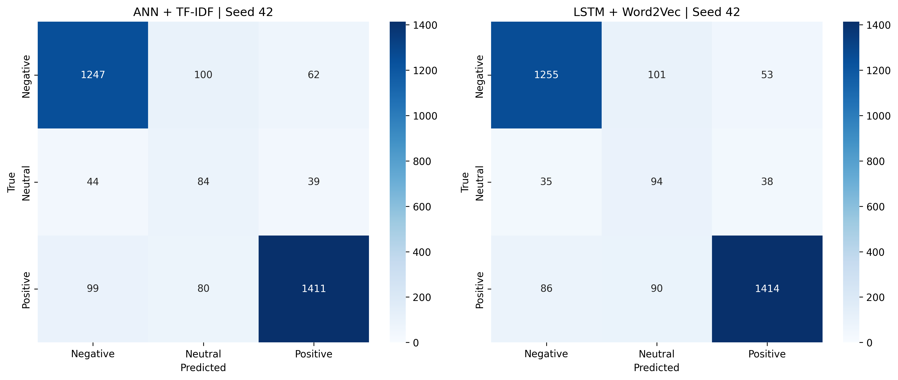
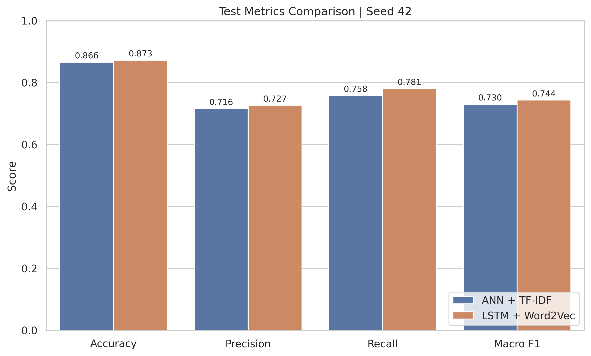

# Vietnamese Student Feedback Sentiment Analysis

This project focuses on sentiment classification for Vietnamese student feedback.
The main objective is to compare a traditional frequency-based representation model with a sequence-based neural model, and evaluate whether preserving word order and contextual information improves sentiment classification performance.

The project compares two main approaches:

1. **ANN + TF-IDF**
2. **LSTM + Word2Vec**

Both models are evaluated using multiple random seeds to reduce the influence of lucky initialization and provide a more reliable comparison.

---

## Table of Contents

- [Problem Statement](#problem-statement)
- [Dataset](#dataset)
- [Task Definition](#task-definition)
- [Model Pipelines](#model-pipelines)
  - [ANN + TF-IDF](#ann--tf-idf)
  - [LSTM + Word2Vec](#lstm--word2vec)
- [Validation Multi-Seed Results](#validation-multi-seed-results)
- [Final Test Results](#final-test-results)
- [Representative Test Visualizations](#representative-test-visualizations)
- [Key Findings](#key-findings)
- [Conclusion](#conclusion)
- [Repository Notes](#repository-notes)

---

## Problem Statement

Student feedback often contains short, informal, and sometimes ambiguous Vietnamese sentences.
The sentiment of a sentence may not always be expressed through a single keyword. In many cases, the final sentiment depends on word order, negation, contrast, or gradual sentiment shifts.

For example, a sentence may contain both positive and negative signals:

```text
Giảng viên nhiệt tình, nhưng cách giải thích của thầy hơi khó hiểu.
```

A frequency-based model may detect both positive and negative keywords, but it does not explicitly preserve the order or relationship between them.
Therefore, this project investigates whether a sequence-based model can better capture the contextual flow of Vietnamese student feedback.

---

## Dataset

The dataset used in this project is the Vietnamese Student Feedback dataset from Hugging Face:

```text
chapter544ou/vietnamese_students_feedback
```

The dataset consists of Vietnamese student feedback sentences labeled into three sentiment classes:


| Label | Sentiment |
| ----- | --------- |
| 0     | Negative  |
| 1     | Neutral   |
| 2     | Positive  |


The data is split into training, validation, and test sets.
The validation set is used for model selection and hyperparameter tuning, while the test set is only used for final evaluation.

---

## Task Definition

The task is a **three-class sentiment classification** problem.

Given a Vietnamese student feedback sentence, the model predicts one of the following labels:

```text
Negative / Neutral / Positive
```

The main evaluation metrics are:

- Accuracy
- Macro Precision
- Macro Recall
- Macro F1

Since the dataset contains class imbalance and the neutral class is relatively harder to classify, **Macro F1** is treated as the most important metric.

---

## Model Pipelines

This project compares two different representation strategies:

1. A lexical frequency-based representation using TF-IDF.
2. A sequence-based representation using Word2Vec embeddings and LSTM.

---

### ANN + TF-IDF

```text
Raw feedback
→ Text preprocessing and tokenization
→ TF-IDF vectorization
→ ANN classifier
→ Sentiment label
```

The ANN + TF-IDF model represents each sentence as a sparse lexical feature vector.
This approach is effective when sentiment is expressed through explicit and familiar keywords.

However, TF-IDF does not explicitly preserve word order.
As a result, it may struggle with sentences involving negation, contrast, or sentiment shifts.

Example limitations:

```text
not bad
good but difficult to understand
enthusiastic but unclear explanation
```

In these cases, the sentiment depends not only on individual words, but also on how the words are connected.

---

### LSTM + Word2Vec

```text
Raw feedback
→ Text preprocessing and tokenization
→ Token IDs
→ Word2Vec embedding lookup
→ LSTM sequence encoder
→ Classifier
→ Sentiment label
```

The LSTM + Word2Vec model reads each sentence as a sequence of word embeddings.
Unlike TF-IDF, LSTM processes tokens in order and updates its hidden state through time.

This allows the model to capture:

- Word order
- Negation
- Contrastive structures
- Sentiment shifts
- Contextual relationships between words

The Word2Vec embedding layer is kept frozen in the final configuration.
This means the LSTM uses a fixed semantic embedding space while learning how to model sentiment from the sequence structure.

## Validation Multi-Seed Results

After model selection and hyperparameter tuning, both models were evaluated on the validation set using four random seeds.

The purpose of multi-seed evaluation is to check whether the result is stable across different random initializations, batch shuffling orders, and dropout patterns.


| Model           | Accuracy            | Macro Precision     | Macro Recall        | Macro F1            |
| --------------- | ------------------- | ------------------- | ------------------- | ------------------- |
| ANN + TF-IDF    | 0.8929 ± 0.0024     | 0.7483 ± 0.0025     | 0.8208 ± 0.0077     | 0.7706 ± 0.0019     |
| LSTM + Word2Vec | **0.8932 ± 0.0025** | **0.7586 ± 0.0064** | **0.8216 ± 0.0070** | **0.7807 ± 0.0063** |


On the validation set, LSTM + Word2Vec achieved a higher Macro F1 score than ANN + TF-IDF.
Although the accuracy of both models is very similar, LSTM performs better in terms of class-balanced evaluation.

This suggests that LSTM improves not simply by predicting more samples correctly overall, but by handling the minority and more ambiguous neutral class more effectively.

---

## Final Test Results

After finalizing the model configurations using the validation set, both models were evaluated on the test set.

The test set represents unseen data that was not used during training or model selection.


| Model           | Accuracy            | Macro Precision     | Macro Recall        | Macro F1            |
| --------------- | ------------------- | ------------------- | ------------------- | ------------------- |
| ANN + TF-IDF    | 0.8628 ± 0.0023     | 0.7137 ± 0.0023     | 0.7629 ± 0.0035     | 0.7282 ± 0.0024     |
| LSTM + Word2Vec | **0.8707 ± 0.0019** | **0.7273 ± 0.0012** | **0.7868 ± 0.0063** | **0.7444 ± 0.0018** |


The LSTM + Word2Vec model outperforms ANN + TF-IDF on all four test metrics.

The largest improvement is observed in Macro Recall and Macro F1:


| Metric          | Improvement |
| --------------- | ----------- |
| Accuracy        | +0.0079     |
| Macro Precision | +0.0136     |
| Macro Recall    | +0.0239     |
| Macro F1        | +0.0162     |


The lower standard deviation of LSTM on Macro F1 also suggests that its performance is more stable across random seeds.

---

## Representative Test Visualizations

The following figures show the comparison between ANN + TF-IDF and LSTM + Word2Vec on a representative test seed.

<p align="center">
  
</p>
<p align="center">
  <i>Figure 1. Test confusion matrix comparison between ANN + TF-IDF and LSTM + Word2Vec on a representative seed</i><br>
</p>

<p align="center">
  
</p>
<p align="center">
  <i>Figure 2. Test metric comparison between ANN + TF-IDF and LSTM + Word2Vec on a representative seed</i><br>
</p>

> Note: The figures above are shown for one representative seed.
> The final reported results are based on the mean and standard deviation across four random seeds.

---

## Key Findings

### 1. TF-IDF is a strong lexical baseline

ANN + TF-IDF performs well because many student feedback sentences contain explicit sentiment keywords.
For example, words related to difficulty, clarity, enthusiasm, or satisfaction can provide strong lexical signals.

However, TF-IDF mainly captures word occurrence and frequency.
It does not explicitly model the order of words or the relationship between phrases.

---

### 2. LSTM better captures contextual sentiment

LSTM + Word2Vec performs better on the final test set because it processes the sentence as a sequence.
This allows the model to preserve the contextual flow of the sentence.

This is especially useful for sentences involving:

```text
negation
contrast
mixed sentiment
sentiment shifts
```

For example:

```text
The lecturer is enthusiastic, but the explanation is still unclear.
```

In this sentence, the final sentiment depends on the relationship between the positive phrase and the negative phrase.
A sequence model has a better chance of capturing this structure than a pure frequency-based model.

---

### 3. LSTM improves generalization on unseen test data

On the test set, LSTM + Word2Vec achieves:

```text
Macro F1 = 0.7444 ± 0.0018
```

while ANN + TF-IDF achieves:

```text
Macro F1 = 0.7282 ± 0.0024
```

This result indicates that LSTM generalizes better to unseen student feedback.
The improvement is not only observed in one seed, but remains stable across multiple random seeds.

---

### 4. Neutral class remains the hardest class

The neutral class is more difficult than negative and positive because neutral feedback often contains less explicit sentiment.
It may also overlap with weakly positive or weakly negative expressions.

The test results show that LSTM improves neutral-class recognition compared with ANN + TF-IDF.
This contributes to the higher Macro F1 score.

---

## Conclusion

In this project, both ANN + TF-IDF and LSTM + Word2Vec were evaluated for Vietnamese student feedback sentiment classification.

ANN + TF-IDF is a strong baseline because it captures important lexical sentiment signals.
However, it does not explicitly preserve word order or contextual relationships.

LSTM + Word2Vec achieves better validation and test performance, especially in terms of Macro F1.
This suggests that modeling word order and contextual flow helps the model better understand Vietnamese student feedback, particularly when the sentiment is expressed through negation, contrast, or mixed emotional signals.

Final test comparison:

```text
ANN + TF-IDF:
Macro F1 = 0.7282 ± 0.0024

LSTM + Word2Vec:
Macro F1 = 0.7444 ± 0.0018
```

Therefore, under the current experimental setup, **LSTM + Word2Vec is the best-performing model**.

---

## Repository Notes

The project includes:

```text
data preprocessing
TF-IDF feature extraction
Word2Vec embedding training
ANN classifier
LSTM classifier
early stopping
multi-seed evaluation
validation and test reports
visualization assets
```

Detailed experiment reports are stored separately from the README to keep this page concise.

Suggested report files:

```text
reports/experiments/multiseed_model_comparison_report_vi.md
reports/experiments/test_multiseed_model_comparison_report_vi.md
```

The README provides a high-level overview of the project, while the reports contain more detailed experimental results and analysis.
